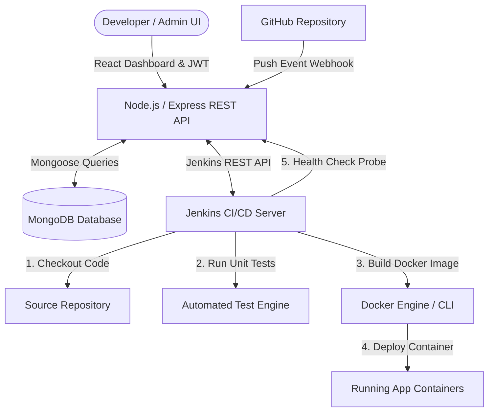

# AutoOps — Portfolio-Grade CI/CD Deployment Platform

[](https://github.com/Vardhan031/CI-CD-platform)
[](LICENSE)

**AutoOps** is a modern, full-stack **CI/CD Deployment & Orchestration Platform** built with **React.js, Node.js, Express.js, MongoDB, JWT Authentication, Role-Based Access Control (RBAC), Jenkins, Docker, and GitHub Webhooks**.

The platform provides developers with a centralized DevOps dashboard to register GitHub projects, configure container ports, trigger automated build pipelines, monitor real-time terminal logs, and perform zero-downtime container rollbacks.

---

## 🎯 Architecture Diagram



---

## ✨ Key Features

1. **JWT Authentication & 3-Tier RBAC**:
   - `ADMIN`: Full platform control, user management, project deletion, deployment triggers & rollbacks.
   - `DEVELOPER`: Manage owned projects, trigger deployments, inspect build logs, and perform rollbacks.
   - `VIEWER`: Read-only access to project registries, pipeline status, and console logs.
2. **Project Registry Management**:
   - Register GitHub repositories, target branches (`main`), Dockerfile paths, and container target ports.
3. **6-Stage Automated CI/CD Pipeline**:
   - `Checkout Code` -> `Install Dependencies` -> `Run Unit Tests` (Aborts pipeline on test failure) -> `Build Docker Image` (Versioned tags `v1.0.x`) -> `Deploy Docker Container` -> `Health Check Verification`.
4. **GitHub Webhook Event Automation**:
   - Listens to incoming `git push` webhooks at `POST /api/webhooks/github` to automatically trigger builds without manual intervention.
5. **Real-time Terminal Console Log Viewer**:
   - Dark-themed terminal console displaying full stdout logs from Jenkins builds with syntax highlighting and copy functionality.
6. **Zero-Downtime Version Rollbacks**:
   - One-click rollback engine redeploying previous verified container image tags (`v1.0.0-rollback.3`) with audit logging.
7. **Hybrid Offline Development Resilience**:
   - Features built-in in-memory fallback stores so the application runs seamlessly locally even before MongoDB or Jenkins containers are booted.

---

## 🛠️ Technology Stack

* **Frontend**: React.js 19, Vite, Tailwind CSS v4, Lucide Icons, React Router DOM v7, Axios.
* **Backend**: Node.js, Express.js, MongoDB / Mongoose, JWT (`jsonwebtoken`), `bcryptjs`, Axios.
* **DevOps & Automation**: Git, GitHub Webhooks, Jenkins (Declarative `Jenkinsfile`), Docker, Docker Compose.

---

## 🚀 Quickstart & Local Installation

### Prerequisites
* **Node.js** (v18+) & **npm**
* **Docker Desktop** (running on your local machine)
* **Git**

### 1. Clone Repository
```bash
git clone https://github.com/Vardhan031/CI-CD-platform.git
cd CI-CD-platform
```

### 2. Configure Environment Variables
Copy `.env.example` to `.env`:
```bash
cp .env.example backend/.env
```

### 3. Install & Start Backend REST API
```bash
cd backend
npm install
npm run dev
```
*Backend runs on `http://localhost:5000` (Health Check: `http://localhost:5000/api/health`).*

### 4. Install & Start Frontend Dashboard
```bash
cd ../frontend
npm install
npm run dev
```
*Frontend opens on `http://localhost:3000`.*

---

## 🐳 Running with Docker Compose

To orchestrate the complete stack (MongoDB + Backend + Frontend) using Docker:

```bash
docker compose up --build -d
```

| Service | Host URL / Port | Container |
|---|---|---|
| **React Dashboard** | `http://localhost:3000` | `cicd_frontend` |
| **Express REST API** | `http://localhost:5000` | `cicd_backend` |
| **MongoDB Database** | `mongodb://localhost:27017` | `cicd_mongodb` |

---

## ⚙️ Jenkins CI/CD Setup Guide

1. Run Jenkins locally in Docker:
   ```bash
   docker run -d --name cicd_jenkins -p 8080:8080 -p 50000:50000 -v /var/run/docker.sock:/var/run/docker.sock jenkins/jenkins:lts-jdk17
   ```
2. Log into Jenkins at `http://localhost:8080` (Retrieve initial admin password via `docker exec cicd_jenkins cat /var/jenkins_home/secrets/initialAdminPassword`).
3. Create a **Pipeline** job named `cicd-deploy-pipeline`.
4. Point Pipeline definition to SCM Git: `https://github.com/Vardhan031/CI-CD-platform.git` and Script Path: `jenkins/Jenkinsfile`.
5. Generate API token in Jenkins User Profile and update `backend/.env`:
   ```env
   JENKINS_URL=http://localhost:8080
   JENKINS_USER=admin
   JENKINS_TOKEN=your_jenkins_api_token
   ```

---

## 📡 REST API Reference Endpoints

### Authentication
* `POST /api/auth/register` — Register a user (`ADMIN`, `DEVELOPER`, `VIEWER`)
* `POST /api/auth/login` — Authenticate user & receive JWT token
* `GET /api/auth/me` — Get active user profile (Protected)

### Projects
* `GET /api/projects` — List registered GitHub repositories
* `POST /api/projects` — Register new project (`ADMIN`, `DEVELOPER`)
* `GET /api/projects/:id` — Get project details & current version status
* `PUT /api/projects/:id` — Update project configuration (`ADMIN`, `DEVELOPER`)
* `DELETE /api/projects/:id` — Unregister project (`ADMIN`, `DEVELOPER`)

### Deployments
* `GET /api/deployments` — List platform-wide pipeline deployments
* `POST /api/projects/:projectId/deploy` — Trigger manual deployment pipeline
* `GET /api/deployments/:id` — Get deployment details & stage status
* `GET /api/deployments/:id/logs` — Fetch console log text stream
* `POST /api/deployments/:id/rollback` — Rollback project to target deployment version

### Webhooks & Health
* `POST /api/webhooks/github` — Public GitHub push event webhook listener
* `GET /api/health` — Platform health status probe

---

## 🧪 Running Automated Test Suites

The backend includes 6 automated test suites covering end-to-end functionality:

```bash
cd backend

# Test Authentication & RBAC (403 Forbidden enforcement)
npm test

# Test Project CRUD Operations
npm run test:project

# Test Deployment Pipeline Records
npm run test:deploy

# Test Jenkins API REST Client
npm run test:jenkins

# Test 6-Stage Declarative Jenkinsfile
npm run test:pipeline

# Test GitHub Push Webhook Listener
npm run test:webhook

# Test Health Check & Rollback Engine
npm run test:rollback
```

---

## 📊 Key Interview Concepts Covered

* **Monorepo Architecture**: Structuring full-stack web applications, REST APIs, and DevOps automation in a unified repository.
* **Stateless JWT & RBAC**: Decoupling user authorization from server state and enforcing role-based permissions.
* **Event-Driven CI/CD**: Utilizing Webhooks to automatically trigger build pipelines on `git push`.
* **Container Versioning & Health Probes**: Building versioned image tags (`v1.0.x`) and validating container health endpoints (`/health`) before declaring success.
* **Fail-Safe Rollbacks**: Performing non-destructive rollbacks that preserve complete deployment audit logs.

---

## 📄 License

Distributed under the MIT License. Built for DevOps learning and demonstration.
