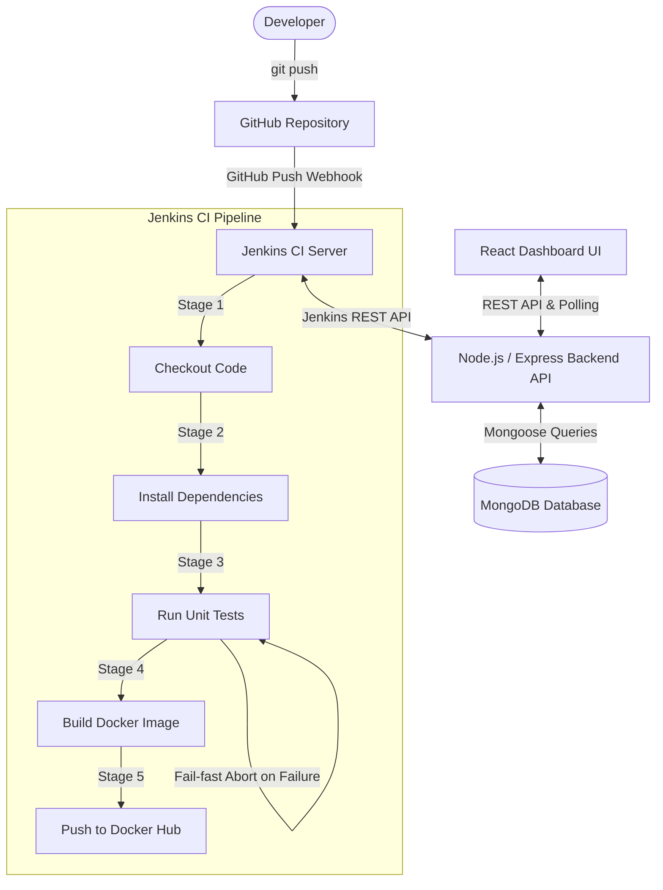

# AutoOps — Project Management & CI Pipeline Platform

[](https://github.com/Vardhan031/CI-CD-platform)
[](LICENSE)

**AutoOps** is a modern, full-stack **Project Management & Continuous Integration (CI) Platform** built with **React.js, Node.js, Express.js, MongoDB, JWT Authentication, Role-Based Access Control (RBAC), Jenkins, Docker, and GitHub**.

The platform provides developers with a centralized management dashboard to register software projects, configure build settings, trigger CI pipelines, monitor build history across projects, inspect real-time Jenkins console stdout logs, and track versioned container image tags (`v1.0.x`) pushed to **Docker Hub**.

---

## 🎯 Architecture Diagram


```mermaid
graph TD
    Developer([Developer]) -->|git push| GitHub[GitHub Repository]
    GitHub -->|GitHub Push Webhook| Jenkins[Jenkins CI Server]

    subgraph Jenkins CI Pipeline
        Jenkins -->|Stage 1| Checkout[Checkout Code]
        Checkout -->|Stage 2| Install[Install Dependencies]
        Install -->|Stage 3| Test[Run Unit Tests]
        Test -->|Fail-fast Abort on Failure| Test
        Test -->|Stage 4| Build[Build Docker Image]
        Build -->|Stage 5| Registry[Push to Docker Hub]
    end

    Jenkins <-->|Jenkins REST API| Express[Node.js / Express Backend API]
    Express <-->|Mongoose Queries| Mongo[(MongoDB Database)]
    React[React Dashboard UI] <-->|REST API & Polling| Express
```

---

## ✨ Key Features

1. **JWT Authentication & 3-Tier RBAC**:
   - `ADMIN`: Full platform control, user management, project registration & deletion, manual CI triggers.
   - `DEVELOPER`: Manage owned projects, trigger CI builds, inspect terminal build logs, re-trigger version builds.
   - `VIEWER`: Read-only access to project registries, pipeline status, and console output logs.
2. **Project Registry Management**:
   - Register GitHub repositories, target branches (`main`), Dockerfile paths, target ports, and Docker Hub image names.
3. **5-Stage Declarative CI Pipeline**:
   - `Checkout Code` -> `Install Dependencies` -> `Run Unit Tests` (Aborts pipeline on test failure) -> `Build Docker Image` (Versioned tags `v1.0.x`) -> `Push Image to Docker Hub`.
4. **Direct GitHub → Jenkins Webhook Automation**:
   - GitHub push events trigger Jenkins directly via the standard Jenkins GitHub Plugin endpoint (`http://<jenkins_url>/github-webhook/`). Express syncs build progress automatically via Jenkins REST API.
5. **Real-time Console Log Stream Viewer**:
   - Dark-themed terminal console displaying real stdout output logs from Jenkins builds with line numbers and copy functionality.
6. **Dynamic Dashboard Metrics & Polling**:
   - Live build status transition (`QUEUED` → `RUNNING` → `SUCCESS` / `FAILED`) powered by frontend polling every 3 seconds during active builds.
7. **Hybrid Offline Development Resilience**:
   - Features built-in in-memory fallback stores so API tests run cleanly even when offline.

---

## 🛠️ Technology Stack

* **Frontend**: React.js 19, Vite, Tailwind CSS v4, Lucide Icons, React Router DOM v7, Axios.
* **Backend**: Node.js, Express.js, MongoDB / Mongoose, JWT (`jsonwebtoken`), `bcryptjs`, Axios.
* **DevOps & Automation**: Git, GitHub Webhooks, Jenkins (Declarative `Jenkinsfile`), Docker, Docker Hub Registry.

---

## 🚀 Quickstart & Local Installation

### Prerequisites
* **Node.js** (v18+) & **npm**
* **Docker Desktop** (running on your local machine)
* **Git**

### 1. Clone Repository
```bash
git clone https://github.com/Vardhan031/CI-CD-platform.git
cd CI-CD-platform
```

### 2. Configure Environment Variables
Copy `.env.example` to `.env`:
```bash
cp .env.example backend/.env
```

### 3. Install & Start Backend REST API
```bash
cd backend
npm install
node src/server.js
```
*Backend runs on `http://localhost:5000` (Health Check: `http://localhost:5000/api/health`).*

### 4. Install & Start Frontend Dashboard
```bash
cd ../frontend
npm install
npm run dev
```
*Frontend opens on `http://localhost:3000`.*

---

## ⚙️ Jenkins & Docker Hub Setup Guide

1. Run Jenkins locally in Docker:
   ```bash
   docker run -d --name cicd_jenkins -p 8080:8080 -p 50000:50000 -v /var/run/docker.sock:/var/run/docker.sock jenkins/jenkins:lts-jdk17
   ```
2. Log into Jenkins at `http://localhost:8080` (Retrieve initial admin password via `docker exec cicd_jenkins cat /var/jenkins_home/secrets/initialAdminPassword`).
3. Create a **Pipeline** job named `cicd-deploy-pipeline`.
4. Point Pipeline definition to SCM Git: `https://github.com/Vardhan031/CI-CD-platform.git` and Script Path: `jenkins/Jenkinsfile`.
5. Add Docker Hub credentials in Jenkins: Go to **Manage Jenkins** -> **Credentials** -> Add Username/Password credential ID: `docker-hub-credentials`.
6. Generate API token in Jenkins User Profile and update `backend/.env`:
   ```env
   JENKINS_URL=http://localhost:8080
   JENKINS_USER=admin
   JENKINS_TOKEN=your_jenkins_api_token
   DOCKER_HUB_USER=vardhan031
   ```

---

## 📡 REST API Reference Endpoints

### Authentication
* `POST /api/auth/register` — Register a user (`ADMIN`, `DEVELOPER`, `VIEWER`)
* `POST /api/auth/login` — Authenticate user & receive JWT token
* `GET /api/auth/me` — Get active user profile (Protected)

### Projects
* `GET /api/projects` — List registered GitHub repositories
* `POST /api/projects` — Register new project (`ADMIN`, `DEVELOPER`)
* `GET /api/projects/:id` — Get project details & active version status
* `PUT /api/projects/:id` — Update project configuration (`ADMIN`, `DEVELOPER`)
* `DELETE /api/projects/:id` — Unregister project (`ADMIN`, `DEVELOPER`)

### CI Deployments / Pipelines
* `GET /api/deployments` — List platform-wide CI pipeline build runs
* `POST /api/projects/:projectId/deploy` — Trigger manual CI build pipeline
* `GET /api/deployments/:id` — Get build details & sync status from Jenkins
* `GET /api/deployments/:id/logs` — Fetch stdout console log stream
* `POST /api/deployments/:id/rollback` — Re-trigger target version build pipeline

### Health
* `GET /api/health` — Platform health status probe

---

## 🧪 Running Automated Test Suites

```bash
cd backend

npm test          # Authentication & RBAC (403 Forbidden enforcement)
npm run test:project  # Project CRUD Operations
npm run test:deploy   # CI Deployment Records & Log Retrieval
npm run test:jenkins  # Jenkins REST API Service Integration
npm run test:pipeline # 5-Stage Declarative Jenkinsfile Validation
```

---

## 📄 License

Distributed under the MIT License. Built for DevOps & Full-Stack Learning and Portfolio Demonstration.
